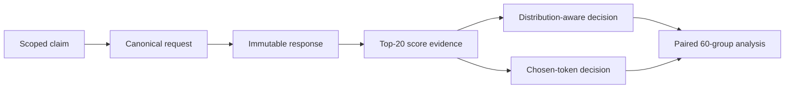
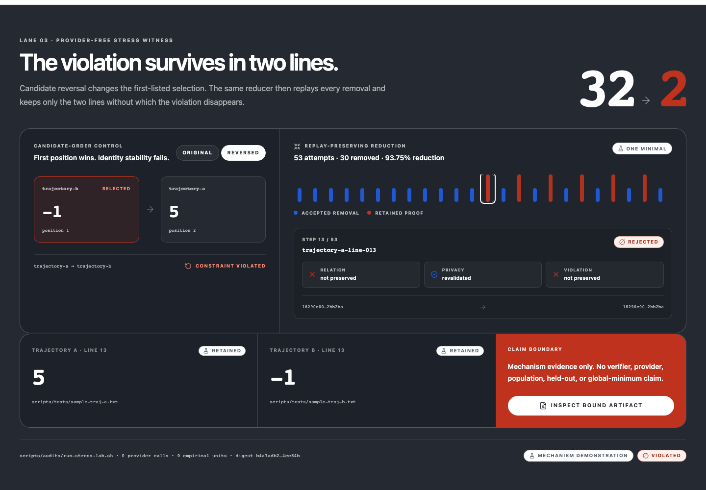

# EvalWitness

**Evidence engineering for reliable AI coding-agent evaluation.**

EvalWitness is a provider-portable, reproducible verifier audit lab for
coding-agent trajectories. It is a Go CLI and stdio MCP service that turns
evaluator decisions into inspectable, replayable artifacts. It binds trajectory
evidence, score evidence, verifier input, decision output, public claim, and
limitation into content-addressed capsules that a second process can validate
offline.

When evidence is missing or a route is not qualified, EvalWitness records
`not_run` or `unsupported` instead of filling the gap with a plausible number.

## The bounded identical-response study

The public empirical package contains 60 locked groups from one attested route
with strict Top-20 score evidence. Both decision arms read the same immutable
completion and differ only in extraction semantics.

| Result | Value |
|---|---|
| Groups | 60 locked, 0 unresolved |
| Agreements | 53 |
| Disagreements | 7 |
| Outcome coverage | 2/60 |
| Route | `bai/deepseek-v4-flash` as technical provenance, not a ranking |

The bounded identical-response study is closed and reproducible. Human validity,
outcome quality, cross-provider transfer, and population generalization were not
studied and are not claimed.

Proof: [`identical-response-offline-analysis-v5.json`](eval/governance/identical-response-offline-analysis-v5.json),
the admitted [v5 capture](eval/governance/identical-response-capture-bai-flash-v5.jsonl),
[attestation](eval/governance/identical-response-route-attestation-v5.json),
[capsule](eval/governance/identical-response-capsule-v5.tar.gz), and
[claim ledger](eval/governance/identical-response-claim-ledger-v5.json).
Clean-clone reproduction: `scripts/evals/reproduce-identical-response-v5.sh`.



## Provider-free mechanism check

40/40 deterministic cases accepted. No model, provider, human-validity, or
generalization claim.

```bash
scripts/audits/run-agent-only-study.sh
```

## Prove one claim in five minutes

```bash
go build -o evalwitness ./cmd/evalwitness
work_root="$(mktemp -d)"
./evalwitness capsule build --repository-root . --destination "${work_root}/reference"
./evalwitness capsule verify \
  --source "${work_root}/reference" \
  --ledger "${work_root}/reference.claims.json" \
  --statement "${work_root}/reference.intoto.json" \
  --projection "${work_root}/reference.projection.json" \
  --autopsy "${work_root}/reference.autopsy.json"
./evalwitness claim autopsy \
  --capsule "${work_root}/reference" \
  --ledger "${work_root}/reference.claims.json" \
  > "${work_root}/claim-autopsy.json"
scripts/demos/run-evidence-explorer-demo.sh \
  --binary ./evalwitness \
  --capsule "${work_root}/reference" \
  --ledger "${work_root}/reference.claims.json" \
  --repository-root . \
  --destination "${work_root}/claim-autopsy.html"
```

This is a local E1 mechanism path: verify a claim, break a declared parent in an
ephemeral copy, observe the exact guard, and render the offline Explorer. It is
not independent reproduction and not a live-provider result.

Broader local mechanism gate: `scripts/evals/reproduce-public-evidence.sh --profile full`.

## Explorer

The bound Explorer renders the claim chain, the seven disagreement rows, challenge
receipts, evidence ceiling, and the copy-paste reproduction command from machine
artifacts. Source: [`web/explorer/`](web/explorer/).

[](assets/stress-witness.png)

## Setup

Build from source. No downloadable release is currently claimed.

```bash
go build -o evalwitness ./cmd/evalwitness
EVALWITNESS_BIN=./evalwitness scripts/tests/run-replay-smoke.sh
```

`./evalwitness doctor` inspects configuration without network access.
Configuration, a preset, a dry run, or a short probe does not qualify a route.
Live verifier use requires a current exact route attestation.

Environment variables and route setup: [documentation](docs/documentation.md).
Pre-publication `LOGPROBE_*` names remain one-release compatibility aliases;
`EVALWITNESS_*` wins.

## What ships

| Surface | Role |
|---|---|
| Verification service | Pairwise, absolute, or delta decisions from strict score evidence; malformed evidence fails closed |
| Evidence supply chain | Capsules and canonical ledgers over request, response, scores, decision, claim, and limitation |
| Research controls | Locked inputs, splits, budgets, route identity, lineage, falsifiers, and non-claims |
| Integrations | CLI, stdio MCP, Best-of-N, protocol adapters, loss-accounted trace export |
| Inspection and release | Bound Explorer, offline reproduction, public artifact scan, deterministic release candidates |

The public tree contains tracked product source, documentation, reviewed
evidence, and reproducible fixtures. [`.gitignore`](.gitignore) excludes secrets,
caches, session exports, and owner-only custody. An artifact-safety scan is the
second control.

## Depth

| Reader | Next |
|---|---|
| Engineer | [Documentation](docs/documentation.md), [spec](docs/spec.md), [contributing](CONTRIBUTING.md) |
| Researcher | [Findings](docs/findings.md) for the full claim set and bounded results |
| Reviewer | [Releasing](docs/releasing.md), [artifact inventory](eval/results/README.md) |

The complete machine-verified claim set lives in
[findings](docs/findings.md) and [documentation](docs/documentation.md).
The README card below is the public subset.

## License

EvalWitness is MIT licensed. See [LICENSE](LICENSE). Exact notices for bundled
Go and Evidence Explorer dependencies ship in
[THIRD_PARTY_NOTICES.md](THIRD_PARTY_NOTICES.md).

<!-- evalwitness:claim-surface:readme:begin -->
### Machine-verified claim view

This block is deterministically derived from the canonical claim ledger and verified capsule. Edit the ledger or evidence, never these rows.

| Claim | Status | Level | Exact value | Governed statement | Required caveat |
|---|---|---|---|---|---|
| CLM-001 | supported | E1 | string:evalwitness.git-visible-source-tree.v1 | The public reference capsule binds a Git-visible source-tree snapshot with the declared source-tree algorithm | Source binding proves artifact identity, not production safety or interface correctness |
| CLM-002 | supported | E1 | boolean:true | The sealed protocol audit records an offline reference-evaluator run over the bound conformance corpus | Protocol conformance does not establish empirical evaluator reliability |
| CLM-003 | supported | E1 | string:digest-bound-external-binary | The capsule digest-binds an external binary to the recorded source snapshot and build metadata | Digest binding does not prove a reproducible build or safety for untrusted use |
| CLM-031 | unsupported | E1 | string:not_run | The repository reproduces the paper's headline empirical results | Reference conformance and dataset tallies are not headline empirical reproduction |
| CLM-032 | unsupported | E1 | number:0 | Findings transfer across providers, gateways, model families, checkpoints, or time | Transfer requires the prespecified multi-provider and longitudinal studies |

View digest: `51295eca3ec66137e59ad30ecab62c9b0dd664655077d152684535fcab35f0c9`

<!-- evalwitness:claim-surface:readme:end -->
