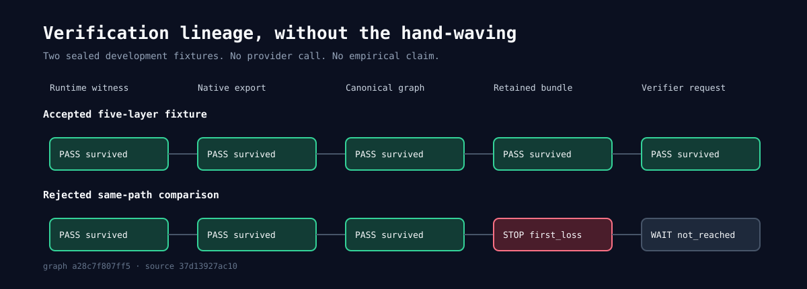
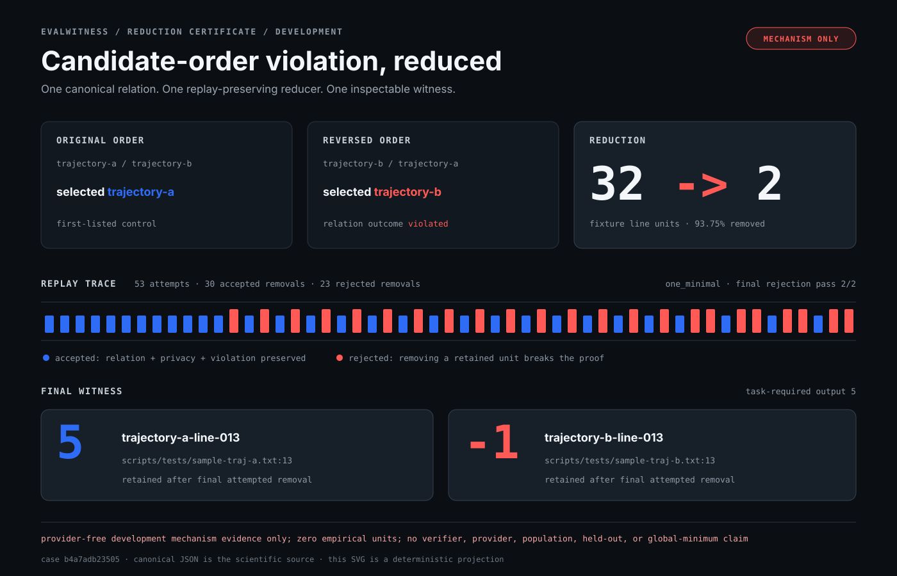

# Committed development results

EvalWitness is a provider-portable, reproducible verifier audit lab for
coding-agent trajectories. This directory is its artifact inventory, not a
leaderboard or a second interpretation layer. Current provider-free evidence and
legacy provider observations stay separate.

## Admitted exact-response package

The identical-response v5 package is the repository's bounded empirical result. It contains
60 complete schema-3 response records from one attested OpenAI-compatible route
(`bai/deepseek-v4-flash`), strict Top-20 evidence for every scored tag, complete
research lineage, and a byte-reproducible offline analysis with 53 agreements, 7
disagreements, and 0
unresolved groups. The route and model are retained as provenance only. This is
not a provider-quality, correctness, or generalization benchmark.

## Current provider-free package

The provider-free publication group contains the capsule-backed Claim Autopsy,
one public evidence-reliance capsule family with five deterministic
projections, two relation results, one 20-file verification-lineage development
package, one stress-lab development case study, one self-contained challenge and
receipt, one held-out campaign topology lock, and one held-out readiness refusal. The
scarcity result has canonical JSON and a deterministic Markdown view; the stress
case has canonical JSON plus deterministic Markdown and SVG projections; the
campaign and readiness refusal have canonical JSON and deterministic Markdown;
the owner
inspection has one claim-safe JSON attestation.
`relation-scarcity-negative-evidence.json` is the closed, content-addressed
machine contract for the public construct-availability result;
`relation-scarcity-negative-evidence.md` is its derived human view. Both bind the
exact attempt, firewall, release, primary, and sentinel chain without exposing
restricted material.
`relation-owner-inspection-attestation.json` exposes only the aggregate result
of a fully verified private 66-assessment owner-inspection chain. It contains no
private journal identity, packet/case identity, mapping, path, task, or evidence
content and makes no human, provider, authorization, held-out, or public-source-
reproduction claim.

The coding-agent-only formal study is published in
`eval/governance/agent-only-study-v1.json`. It is a separate machine-only
contract over the frozen v3 controlled-relation release: 20 calibration and 20
test cases, exact source lineage, two independent validators, an automated
disagreement-only tie-break, and zero provider calls or human reviewers. Its
digest is `e50a428c0af34f8b6ff3c06dd5eb66b44c1073c5999d49f0681ce369b4b9348b`.
It supports formal relation-integrity claims only, not human semantic validity,
provider quality, transfer, prevalence, or population generalization.

The verification-lineage package is a provider-free development artifact. Its
canonical graph, conserved audit, positive BOM, counterexample loss certificate,
dataset card, limitations ledger, and manifest are deterministic descendants of
the sealed verification-lineage development evidence. The dataset card records two
development fixtures, zero empirical task groups, and zero research-admitted
sources. It is not a provider result or completed research corpus.

`stress-development-case-study-v1.json` is the closed machine artifact for a
candidate-order negative control built from the checked-in MIT fixtures. The
first-listed baseline violates the canonical sensitivity relation after order
reversal. The shared reducer removes 30 of 32 line units and leaves a two-line
one-minimal witness containing `5` and `-1`; the Markdown and SVG files are
derived from that validated object. The artifact declares `empirical_units=0`,
`provider_calls=0`, and `network_required=false`. It is mechanism evidence, not
a verifier, provider, held-out, population, or global-minimum result.

`stress-development-challenge-v1.json` embeds the exact task, two trajectory,
and MIT-license bytes used by that case study. A verifier can therefore rebuild
the same 53-attempt reduction and two-line one-minimal witness without a
repository checkout or fixture lookup. The deterministic
`stress-development-challenge-receipt-v1.json` records four verified fixtures,
seven passed controls and adversarial guards, `empirical_units=0`,
`provider_calls=0`, and `network_required=false`. The package exercises the same
EvalWitness implementation; it is not an independent reimplementation,
held-out confirmation, population evidence, or verifier-reliability result.

`stress-held-out-campaign-plan-v1.json` freezes the exact ten-arm test topology:
57 cases, 1,140 cells, 440 supported cells, 700 structural unsupported cells,
456 live-provider verification inputs over two arms, 228 sealed-replay inputs
for the offline-only protocol adapter, 2,052 total provider-dependent side
repetitions, and 294 deterministic zero-cost repetitions. Its nine live-binding
flags are false. It is a provider-free reconstruction and workload contract,
not a call estimate, execution permit, study record, route attestation, budget,
empirical result, or private capsule.

`stress-held-out-readiness-refusal-v1.json` is the closed current-state
preflight for the governed held-out boundary. It rebuilds the exact 57-case,
1,140-cell partition, binds the expected private owner-package inventory digest,
and verifies the current owner projection. It reports one passed gate, the
`revision_required` owner gate as blocked, six unavailable gates, no execution
permit, zero empirical units, zero provider calls, and no network requirement.
Its Markdown file is a deterministic human view. Neither file is a held-out
result or execution authorization.

## Evidence-reliance mechanism publication

The evidence-reliance publication is a provider-free E1 mechanism fixture, not an
external-model study. `evidence-reliance-base-capsule-v1/` and
`evidence-reliance-base-claims-v1.json` freeze the verified public reference
parent used before the reliance descendants entered the tree. Rebuilding that
parent from the current tree would include its own descendants and create a
self-reference cycle, so every publication and verification path loads the
frozen parent instead.

The public child is derived on demand from
`evidence-reliance-map-v1.json`. The map binds 24 source-task fixtures, 64 cells
per task, 1,536 registered and outcome-bearing cells, 1,560 logical exact-replay
calls, 14 frozen terms, seven outcomes, 1,392 measured cells, 144 abstentions,
ten selector audits, one arm-comparison artifact exposing five prespecified
contrast families, and one privacy-safe one-minimal witness. It reports zero
provider calls, requires no network, and prohibits a global explainability or
trust score.

The remaining tracked files are deterministic descendants of that map and child
capsule:

| artifact | contract |
|---|---|
| `evidence-reliance-claims-v1.json` | 11 capsule-derived claims: CLM-035 through CLM-042 supported at E1; CLM-043 through CLM-045 unsupported |
| `evidence-reliance-profile-v1.json` | 98 scoped reliability dimensions with exact registered, eligible, excluded, status, estimate, uncertainty, and caveat fields |
| `evidence-reliance-paper-v1.json` | 98 machine-derived paper rows, eight current claim IDs, three unsupported claim IDs, and six frozen limitations |
| `evidence-reliance-explorer-v1.json` | privacy-safe interactive projection over all 98 outcomes, ten selectors, five arm contrasts, and one witness |

`capsule build-reliance` publishes the public child directory, deterministic
archive, and ledger only to absent destinations. `capsule verify-reliance`
verifies the frozen parent, child family, map identity, complete ledger, and all
three projections. Claimcheck builds the child in a temporary directory,
byte-compares the generated ledger, verifies all five tracked artifacts, and
scans the complete public set. None of these files establishes provider,
model-family, route, entrypoint, population, agent-causality, or model-internal
transfer.

## Legacy captured runs

Eleven legacy JSON runs record one requested route and model plus per-task details,
signal calibration, and zero-cost baselines. Their `route` blocks record
provider `opencode-go-cn`, requested model `deepseek-v4-flash`, base URL,
evaluation timestamp, and the historical `logprobe_version` field. They do not
record a provider-issued served checkpoint identity. The operator-selected
preset name ended in `0731`, but these artifacts cannot verify that checkpoint
suffix.

**Regenerated 2026-08-07** from the response cache, which is why every file
carries that date and `usage.cache_hit_calls == usage.calls`. The underlying
provider responses were collected between 2026-08-06 and 2026-08-07. These are
legacy E1 result artifacts, not exact-response bundles. The read-only custody
census finds 17,876 schema-1 response files, including at most 6,306 in the
`opencode-go-cn` namespace, while these eleven result files report 6,599
cache-hit calls. Schema 1 lacks full request, response, route, parser/evidence,
binary, source-tree, dataset, analysis, and collection-clock identity, so no
one-to-one source map can be proven and zero legacy entries are exact-bundle
admissible. A warm-cache rerun may reproduce the scientific result fields, but
it is not a guaranteed canonical-byte or historical-response reproduction.

**Artifact gate.** `usage.unextracted_scores` is 0 in every file, without
exception. A single unextracted score tag would mean a comparison silently fell
back to 0.5, so a run carrying one is not publishable and the scripts refuse to
write it.

**Data role.** Every task in these artifacts is development-only. The committed
`eval/governance/development-inventory.json` binds the exact artifact SHA-256s,
the union of 89 Terminal-Bench task IDs, the union of 500 SWE-bench task IDs,
and `confirmation_permitted=false`. `evalwitness study inventory` recomputes
that boundary from the artifacts. These runs remain useful case-study and
regression evidence; no reanalysis promotes them into held-out confirmation.

## Terminal-Bench 2

89 tasks, 5 trajectories each. **17 tasks are decidable** — at least one
trajectory passes and at least one fails. On the other 72 selection cannot change
the outcome, so they carry no information about any selector.

Pass@1 72.8/89, oracle 80/89. These rows are historical development
eval-terminal artifacts and are not the locked v5 identical-response
estimand. The current v5 schema-3 capture and registered offline analysis answer
distribution-aware vs chosen-token on 60 identical completions separately; they
do not retroactively change these historical rows.

The v5 study's canonical machine graph lives under `eval/governance/`: response
bundle capsule `3b26fefb...`, outer capsule `2ba8ac46...`, sealed claims
`CLM-070` through `CLM-074`, 34 passing challenge receipts, 53 agreements, seven
disagreements, zero unresolved groups, and only 2/60 outcome-covered groups. The
release-built Explorer derives those values directly from the verified graph.
They are not additional result files in this directory and do not support
correctness, model quality, transfer, or population claims.

| artifact | configuration | score | calls | signal AUC |
|---|---|---|---|---|
| `terminal-bench-verifier.json` | shipped defaults: tournament, 32k evidence, bundled criteria, K=1 | 78/89 | 97 | 0.828 |
| `terminal-bench-judge.json` | identical, raw-text extraction instead of the distribution | 76/89 | 68 | 0.856 |
| `terminal-bench-all-pairs.json` | exhaustive all-pairs instead of the tournament | 78/89 | 234 | 0.851 |
| `terminal-bench-absolute.json` | each trajectory scored alone, no pairwise comparison | 75/89 | 85 | — |
| `terminal-bench-evidence-16k.json` | evidence budget halved to 16k | 75/89 | 103 | 0.844 |
| `terminal-bench-paper-parity.json` | reference pipeline: 4 reps, one criterion per call, no bundling | 78/89 | 2,040 | — |

## SWE-bench Verified

500 instances, 3 trajectories each. **86 instances are decidable.**

Pass@1 380.3/500, oracle 422/500.

| artifact | configuration | score | calls | signal AUC |
|---|---|---|---|---|
| `swebench-verifier.json` | shipped defaults | 385/500 | 206 | 0.621 |
| `swebench-judge.json` | identical, raw-text extraction | 387/500 | 172 | 0.625 |
| `swebench-all-pairs.json` | exhaustive all-pairs | 385/500 | 300 | 0.653 |
| `swebench-size-agnostic.json` | criteria with the patch-size clauses removed | 391/500 | 198 | 0.667 |
| `swebench-paper-parity.json` | reference pipeline | 386/500 | 3,096 | — |

## Reading these files

The standalone
[`verification-lineage-development-release-v1.json`](verification-lineage-development-release-v1.json)
binds 20 files, all public, by path, role, byte count, and SHA-256. Its machine source
for the visual is
[`verification-lineage-offline-graph-v1.json`](verification-lineage-offline-graph-v1.json),
and the SVG is a deterministic projection rather than an independent numeric
source. The accepted path links to a complete verification-evidence BOM; the
rejected path stops a same-path comparison before retention. The seven-entry
limitations ledger keeps empirical survival, population prevalence, format and
syntax transfer, human construct validity, provider quality, and capsule
integration outside the current claim surface.



The standalone
[`relation-scarcity-negative-evidence.json`](relation-scarcity-negative-evidence.json)
is the machine source for the provider-free result. Claimcheck strictly validates
its schema and internal digest, regenerates it byte-for-byte from six public
parents, and derives the
[`Markdown view`](relation-scarcity-negative-evidence.md) from the same object.
Its 198-attempt eligibility funnel, 3 admissions, 195 closed rejections, 2/1/0
roles, and forbidden claims are a provider-free research result, not an LLM
evaluation run. Downstream tools consume JSON and never parse Markdown.

The standalone
[`relation-owner-inspection-attestation.json`](relation-owner-inspection-attestation.json)
records 66/66 owner-authorized agent-assisted assessments, seven accepted core
constructs, one accepted and two revision-required scarcity constructs, and
combined `revision_required` status. Claimcheck validates its closed schema,
content and file digests, exact denominators, aggregate outcomes, disclosure
boundary, and claim states. Reproducing the private source chain requires the
withheld owner package and journal, so public validation is deliberately narrower
than independent source reproduction.

The standalone
[`stress-development-case-study-v1.json`](stress-development-case-study-v1.json)
strictly binds the task, both trajectory fixtures, MIT license, canonical
candidate-order relation, zero-cost observation, complete reducer chain, exact
two-line witness, and closed claim boundary. Its content digest is
`b4a7adb23505a88ee0ab79c73957bce5fbd15539a0e5e687590719d3ec4ee84b`;
the [Markdown view](stress-development-case-study-v1.md) and paper-ready
[reduction certificate](stress-development-case-study-v1.svg) are deterministic.
The SVG exposes the order flip, all 53 reducer decisions, exact final witness,
one-minimal status, and mechanism-only claim boundary without becoming another
numeric source. `scripts/audits/run-stress-lab.sh` rebuilds all three twice,
byte-compares them, checks the schema and repository fixtures, and proves
provider configuration does not affect the result.

The standalone
[`stress-development-challenge-v1.json`](stress-development-challenge-v1.json)
is the checkout-independent mechanism package for the same case. The paired
[`stress-development-challenge-receipt-v1.json`](stress-development-challenge-receipt-v1.json)
binds challenge digest
`c583a2379af4d148a5140682fd04f513af0c16520e02fca567d487a387da2901`,
case digest
`b4a7adb23505a88ee0ab79c73957bce5fbd15539a0e5e687590719d3ec4ee84b`,
and seven exact guard outcomes. The stress audit regenerates both twice and runs
the full challenge from an empty directory and empty home with poisoned provider
configuration. This proves portability of the declared mechanism package, not
independent implementation replication.



The standalone
[`stress-held-out-campaign-plan-v1.json`](stress-held-out-campaign-plan-v1.json)
is the machine source for the exact held-out campaign topology. Its deterministic
[Markdown view](stress-held-out-campaign-plan-v1.md) exposes every arm count,
cell-set commitment, repetition count, absent live binding, and non-claim. The
stress audit rebuilds both twice with poisoned provider configuration,
byte-compares them, strictly validates the closed schema against the current
corpus, and rejects parent, arm-surface, cell-set, or live-binding substitution.

No held-out campaign batch-binding result is tracked. Its closed schema and
implementation exist, but a real document requires the exact study-bound live
batch previews, strict-verifier sealed replay batch, current route and execution
parents, and private capsule references. A synthetic or parent-free document
would falsely imply execution readiness.

The standalone
[`stress-held-out-readiness-refusal-v1.json`](stress-held-out-readiness-refusal-v1.json)
is the machine source for the current no-run decision. The deterministic
[Markdown view](stress-held-out-readiness-refusal-v1.md) exposes all eight gate
states and their evidence or exact unavailable reason. The stress audit rebuilds
both twice with poisoned provider configuration, byte-compares them, strictly
validates the closed schema against the current corpus and owner evidence, and
rejects any resealed execution-permit promotion.

Absolute selection and the parity runs report no AUC because neither records
pairwise decisions: absolute mode never compares two trajectories, and the
reference pipeline uses a fixed-repetition path that emits no per-pair
distribution.

The absolute artifact is audited through its distinct rank expression: 85 rows
over 17 decidable Terminal-Bench tasks produce Spearman 0.377 with a 95%
task-cluster interval of [0.183, 0.564].

Every artifact contains four blocks worth knowing about:

| block | what it holds |
|---|---|
| `details` | per task: rewards, Pass@1, oracle, selected index and its reward, and every pair decision with its expectation, variance, score mass and win probability |
| `calibration` | development-only reliability over decidable pairs. These 2026-08-07 artifacts carry the legacy scalar block; the audit command normalizes them to `logprobe.reliability.v1`, and newly generated artifacts additionally embed typed intervals, error strata, and traceable source rows |
| `baselines` | every zero-cost selector, both directions of every artifact feature, each paired against this run with McNemar exact and the smallest split that would have been significant |
| `route` | provider, model, served model, base URL, timestamp, binary version |

## Reproducing

Without a provider, from this repository alone:

```bash
scripts/evals/reproduce-public-evidence.sh --profile full  # hard network denial, empty state, zero provider calls
scripts/tests/run-claimcheck.sh                       # recomputes every statistic the docs quote
scripts/audits/run-stress-lab.sh                      # reproduces the stress catalog, case study, self-contained challenge/receipt, and optional held-out lock/campaign/readiness refusal
scripts/audits/run-agent-only-study.sh                 # reproduces and validates the coding-agent-only 20/20 formal study
reliance_root="$(mktemp -d)/reliance-capsule"
./evalwitness capsule build-reliance \
  --base-capsule eval/results/evidence-reliance-base-capsule-v1 \
  --map eval/results/evidence-reliance-map-v1.json \
  --destination "${reliance_root}"
./evalwitness capsule verify-reliance \
  --base-capsule eval/results/evidence-reliance-base-capsule-v1 \
  --source "${reliance_root}" \
  --map eval/results/evidence-reliance-map-v1.json \
  --ledger eval/results/evidence-reliance-claims-v1.json \
  --profile eval/results/evidence-reliance-profile-v1.json \
  --paper eval/results/evidence-reliance-paper-v1.json \
  --explorer eval/results/evidence-reliance-explorer-v1.json
./evalwitness stress verify-development-challenge --challenge @eval/results/stress-development-challenge-v1.json
./evalwitness stress verify-development-challenge-receipt --challenge @eval/results/stress-development-challenge-v1.json --receipt @eval/results/stress-development-challenge-receipt-v1.json
scripts/audits/run-paired-analysis.sh eval/results/swebench-verifier.json eval/results/swebench-judge.json
scripts/audits/run-calibration-analysis.sh eval/results/*-verifier.json
scripts/audits/run-calibration-analysis.sh --format json eval/results/*-{verifier,judge}.json
./evalwitness relation validate --type owner-inspection-public-attestation --document @eval/results/relation-owner-inspection-attestation.json
./evalwitness trace lineage development-release-verify --repository-root . \
  --document @eval/results/verification-lineage-development-release-v1.json
```

The JSON audit form is the development error-strata manifest. It records the
schema and data role, deterministic task-cluster interval method, source
artifact SHA-256, run context, fixed error bands, and every wrong-direction
source row with task and pair identity, extraction mode, calls, inferred pair
ceiling, score mass, score difference, outcome, and order provenance. The older
artifacts did not record order identifiers; those rows say
`not-recorded-in-legacy-artifact` rather than inventing them.

With a key, a qualified route, explicit live authorization, and a locked study,
`evalwitness eval-terminal --details --output json` and
`evalwitness eval-swebench --details --output json` create new observations. A
cold cache means real provider calls; check `usage.cache_hit_calls` against
`usage.calls` to know which you got. A new route observation is never relabeled
as the historical route state. The prospective exact-response study must capture
schema 3 from the start and include redistribution evidence before publication.
