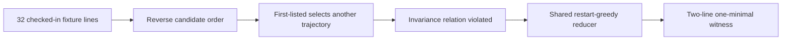

# Candidate-order failure reduced to a two-line witness

> Provider-free development mechanism evidence. This is not a verifier reliability result.

## Result

| Evidence | Observed value |
|---|---|
| Relation | `v3-sensitivity-candidate_order_reversal` |
| Negative control | `zero-cost-first-listed` |
| Original selection | `trajectory-a` |
| Reversed selection | `trajectory-b` |
| Relation outcome | `violated` |
| Reduction | 32 fixture lines to 2, 93.75% removed |
| Minimality | `one_minimal` |
| Provider calls | 0 |
| Network required | `false` |
| Empirical units | 0 |
| Case-study digest | `b4a7adb23505a88ee0ab79c73957bce5fbd15539a0e5e687590719d3ec4ee84b` |



## Final witness

| Trajectory | Repository source | Retained content |
|---|---|---|
| `trajectory-a-line-013` | `scripts/tests/sample-traj-a.txt:13` | `5` |
| `trajectory-b-line-013` | `scripts/tests/sample-traj-b.txt:13` | `-1` |

The task requires output `5`. The retained fixture outputs `5` and `-1`, so the two candidates remain distinct while the first-listed control changes identity after reversal. Every removed line was replayed through the same relation, privacy, and violation oracle. The final rejection pass proves deterministic one-minimality over declared line units, not a global minimum.

## Claim boundary

| Status | Claim |
|---|---|
| allowed | `checked_in_fixture_reproduction` |
| allowed | `deterministic_candidate_order_negative_control` |
| allowed | `shared_one_minimal_reducer_mechanism` |
| forbidden | `global_minimum` |
| forbidden | `held_out_confirmation` |
| forbidden | `model_or_provider_comparison` |
| forbidden | `population_generalization` |
| forbidden | `verifier_reliability_estimate` |

provider-free development mechanism evidence only; zero empirical units; no verifier, provider, population, held-out, or global-minimum claim

## Reproduce

```bash
./evalwitness stress development-case-study --repository-root . --format json
./evalwitness stress development-case-study --repository-root . --format markdown
./evalwitness stress development-case-study --repository-root . --format svg > /tmp/evalwitness-stress-certificate.svg
./evalwitness stress validate --type development-case-study --repository-root . --document @eval/results/stress-development-case-study-v1.json
```
